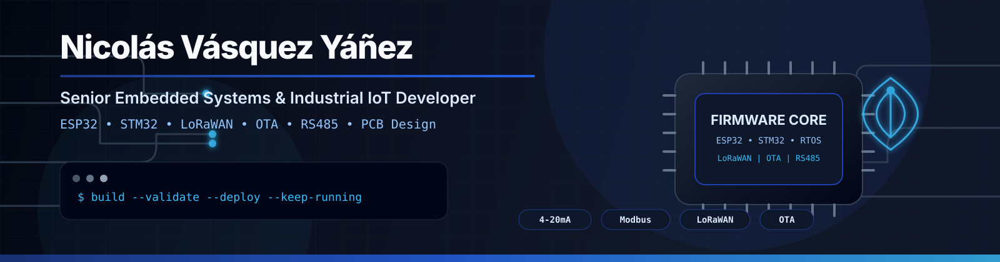
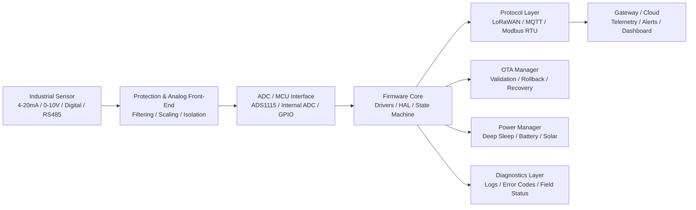

  

  
  
  
  
  

  
  
  
  

# Hi there, I'm Nicolás Vásquez Yáñez 👋

## Senior Embedded Systems & Industrial IoT Developer  
### ESP32 | STM32 | LoRaWAN | Firmware Architecture | Hardware Integration | PCB Design

I build **robust embedded systems, industrial IoT devices, and production-oriented firmware architectures** designed to operate reliably in demanding real-world environments.

With over **8 years of end-to-end hardware and firmware experience**, I specialize in taking products from **concept and prototype** to **field-ready deployment**.

I do not just write code.  
I engineer **complete embedded solutions** that can survive noisy signals, remote operation, industrial constraints, low-power requirements, harsh environments, and firmware recovery scenarios.

> **Embedded firmware is not only about making hardware work.  
> It is about making it keep working in the real world.**

---

## 🚀 What I Build

<table>
<tr>
<td width="33%">

### ⚙️ Embedded Firmware
- ESP32 / STM32 development
- Modular firmware architecture
- Drivers / HAL / RTOS
- Deterministic state machines
- Low-level debugging
- OTA-ready firmware

</td>
<td width="33%">

### 📡 Industrial IoT
- LoRaWAN telemetry nodes
- RS485 / Modbus RTU systems
- MQTT communication
- Gateway integration
- Remote monitoring
- Field diagnostics

</td>
<td width="33%">

### 🔌 Hardware & PCB
- PCB-integrated firmware
- Altium / KiCad workflows
- 4–20 mA / 0–10 V acquisition
- Industrial I/O
- Protection and signal conditioning
- Board-level validation

</td>
</tr>
</table>

---

## 🧰 Embedded Technology Stack

### Firmware & Embedded Systems

  
  
  
  
  
  

### Microcontrollers & Platforms

  
  
  
  

### Development Tools

  
  
  
  
  
  

### Hardware & PCB Design

  
  
  
  
  
  

### IoT, RF & Connectivity

  
  
  
  
  
  

### Industrial Interfaces & Signals

  
  
  
  
  
  
  
  

---

## 🛡️ Firmware Reliability Matrix

| Area | What I Implement |
|---|---|
| **Boot Safety** | OTA partitions, firmware validation, rollback strategy, safe boot workflows |
| **Runtime Stability** | Watchdogs, bounded retries, deterministic state machines, task isolation |
| **Industrial I/O** | 4–20 mA, 0–10 V, RS485, Modbus RTU, relay control, digital I/O |
| **Connectivity** | LoRaWAN, MQTT, WiFi, BLE, UART modem control, XBee/DigiMesh |
| **Power Strategy** | Deep sleep, telemetry cycles, battery operation, solar-powered systems |
| **Field Diagnostics** | Serial logs, error codes, status payloads, remote recovery paths |
| **Production Readiness** | Versioning, commissioning flow, validation notes, maintainable architecture |
| **Hardware Integration** | PCB bring-up, signal validation, peripheral testing, board-level debugging |

---

## 🧩 Embedded System Architecture

---

## 🚀 From Prototype to Field Deployment

---

## 📂 Open-Source Technical Samples

These repositories showcase my coding standards, embedded architecture, RTOS management, industrial interfaces, and implementation style.

  
  

### 📡 ESP32 LoRaWAN Industrial Node
- ESP32
- Seeed LoRa-E5 through UART AT commands
- ADS1115 analog acquisition
- 4–20 mA industrial sensor input
- Compact binary payload encoding
- Deep Sleep optimization

**Architecture:** wake → measure → encode → uplink → sleep.

### 🔄 ESP32 Robust OTA Architecture
- FreeRTOS task isolation
- PID control task separation
- HTTPS firmware download
- SHA-256 firmware validation
- Dual OTA partitions
- Watchdog-aware design
- Automatic rollback protection

**Architecture:** keep critical control logic deterministic while OTA runs safely in parallel.

---

## 🏭 Featured Industrial & Field Projects

I focus on mission-critical systems where reliability is not optional.

| Project | Area | Focus |
|---|---|---|
| 🌊 [Colbún Hydroelectric Early Warning System](https://www.youtube.com/watch?v=atfTgxQO1dA) | Energy / Monitoring | Robust environmental monitoring and alert system for a major energy facility |
| 🚨 [SAT / EWARS Viña del Mar](https://www.youtube.com/watch?v=G301dtDWlcg) | Urban Risk Prevention | Early warning system development for urban disaster prevention |
| ☁️ [Cloud Seeding System — Mettech Seerain](https://youtu.be/6tkjbmUdPcM) | Atmospheric Systems | Complex control hardware for atmospheric weather modification |
| ⚙️ [Custom Hardware & PCB Development](https://youtu.be/EI487dh6bS8) | Hardware Engineering | Complete board design, assembly, and low-level firmware integration |
| 🎵 [Musical Swing — Sergafel](https://youtu.be/dYeEN-3rE7M) | Interactive Hardware | Robust public-use hardware with embedded control and sensing |

---

## ⚙️ Engineering Capabilities

<table>
<tr>
<td width="50%">

### Embedded Firmware
- Modular C/C++ firmware architecture
- ESP32 and STM32 development
- RTOS task separation and scheduling
- Deterministic state machines
- Watchdog-aware design
- Driver development and hardware abstraction
- Serial communication and binary protocols
- Peripheral integration and low-level debugging

</td>
<td width="50%">

### Industrial IoT
- LoRaWAN telemetry nodes
- UART AT modem integration
- MQTT communication
- RS485 and Modbus RTU devices
- Sensor telemetry pipelines
- Remote monitoring systems
- Compact payload encoding
- Cloud and gateway integration

</td>
</tr>
<tr>
<td width="50%">

### Hardware & PCB
- Schematic and PCB design support
- Altium Designer and KiCad workflows
- Industrial-grade board integration
- Analog signal conditioning
- 4–20 mA and 0–10 V acquisition
- Relay, digital I/O, and power-stage integration
- Hardware bring-up and validation
- Board-level troubleshooting

</td>
<td width="50%">

### Reliability & Field Operation
- OTA firmware update flows
- Rollback-safe firmware deployment
- Runtime fault recovery
- Error reporting and diagnostics
- Low-power telemetry cycles
- Battery and solar operation
- Field commissioning support

</td>
</tr>
</table>

---

## 📊 GitHub Metrics

  
  

---

## 📈 Recent GitHub Activity

  

---

## 🧪 Current Areas of Interest

- Industrial LoRaWAN telemetry nodes
- ESP32 OTA update pipelines
- STM32WLE5 / LoRa-E5 modem architectures
- RS485 / Modbus RTU industrial gateways
- Battery and solar-powered IoT systems
- Edge firmware for monitoring and control
- Robust embedded architecture for field deployment
- AI-assisted firmware and PCB workflows
- Industrial monitoring and early warning systems
- Modular IoT hardware for scalable deployments

---

## 👨‍🏫 Mentorship & Community

Beyond industrial development, I am passionate about sharing knowledge.

I regularly conduct online workshops and teach robotics to kids and teenagers, translating complex low-level engineering concepts into accessible learning experiences.

📺 [Watch a snippet of my Online Workshops](https://youtu.be/h6abCMyFRaY)

---

## 🧰 Repository Quality Principles

When I publish technical repositories, I aim to include clear architecture overviews, hardware wiring notes, PlatformIO build instructions, payload documentation, commissioning notes, operational considerations, and future production-hardening roadmaps.

---

## 🤝 Let's Work Together

Looking for a senior embedded systems developer to architect your next IoT product, industrial telemetry node, control system, or to rescue a failing prototype?

Let's discuss your technical requirements.

  
  
  

---

## ⚡ Engineering Philosophy

Embedded systems fail in the details: bad power design, noisy signals, poor recovery logic, weak OTA strategy, unclear diagnostics, fragile prototypes, and untested edge cases.

My job is to design firmware and hardware integration that anticipates those problems before the product reaches the field.

**Build it. Validate it. Deploy it. Keep it running.**

  

