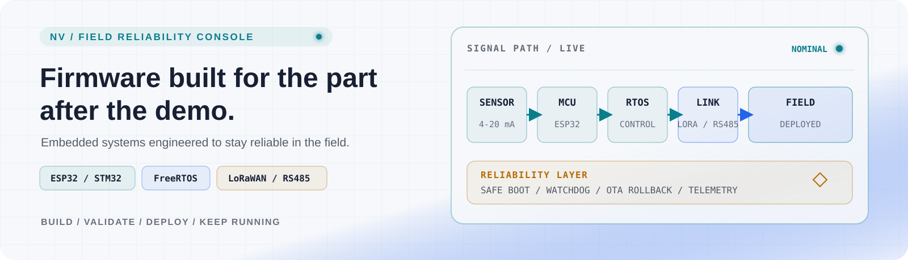
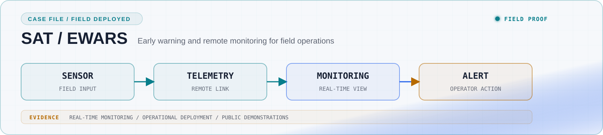
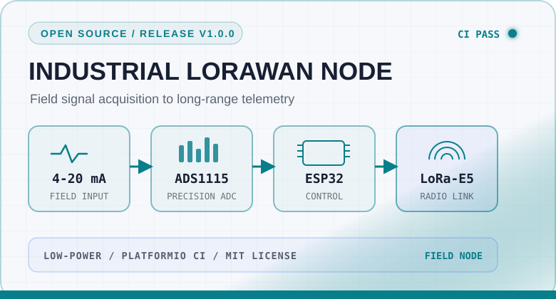
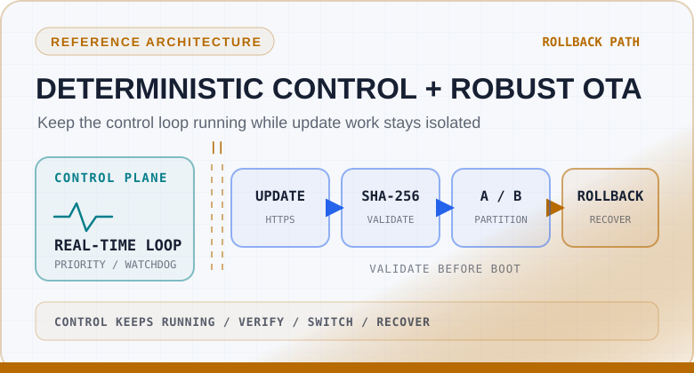

<picture>
  <source media="(prefers-color-scheme: dark)" srcset="./assets/field-reliability-console-dark.svg">
  <source media="(prefers-color-scheme: light)" srcset="./assets/field-reliability-console-light.svg">
  
</picture>

# Nicolás Vásquez Yáñez

**Embedded Systems & Industrial IoT Developer**<br>
Viña del Mar, Chile · Firmware, electronics, connectivity, and field reliability

> **Firmware built for the part after the demo.**

I design embedded systems that move from board bring-up to dependable field deployment. My work connects deterministic control, industrial signals, remote telemetry, diagnostics, and recovery into one maintainable system.

[Selected systems](#selected-systems) · [Reliability matrix](#reliability-matrix) · [Field Ops Live](#field-ops-live) · [Contact](#contact) · [Leer en español](./README.es.md)

## Operational status

<p align="center">
  <a href="https://github.com/dev-nicolasv/esp32-lorawan-industrial-node/actions/workflows/platformio.yml"></a>
  <a href="https://github.com/dev-nicolasv/esp32-robust-ota-architecture/actions/workflows/firmware-ci.yml"></a>
  <a href="https://github.com/dev-nicolasv/dev-nicolasv/actions/workflows/update-engineering-status.yml"></a>
  <a href="https://github.com/dev-nicolasv/esp32-lorawan-industrial-node/releases/latest"></a>
  <a href="https://github.com/dev-nicolasv/esp32-lorawan-industrial-node/blob/main/LICENSE"></a>
</p>

`FIELD / ACTIVE` From early prototypes and PCB integration to validation, commissioning, and field-oriented hardening. I focus on the constraints that decide whether a device keeps working after deployment: noisy signals, limited power, intermittent connectivity, remote maintenance, and controlled recovery.

## Selected systems

### SAT / EWARS · Early-warning systems in the field

<picture>
  <source media="(prefers-color-scheme: dark)" srcset="./assets/sat-ewars-field-card-dark.svg">
  <source media="(prefers-color-scheme: light)" srcset="./assets/sat-ewars-field-card-light.svg">
  
</picture>

**Context:** connectivity, real-time monitoring, and operational field deployment for early-warning systems.<br>
**Engineering territory:** embedded acquisition, control hardware, telemetry, field integration, and commissioning.<br>
**Public evidence:** [connectivity and monitoring demonstration](https://www.youtube.com/watch?v=atfTgxQO1dA) · [operational deployment at Colbún](https://www.youtube.com/watch?v=G301dtDWlcg)

These systems reflect the work I value most: translating environmental signals into dependable information and actionable alerts.

<table>
  <tr>
    <td width="50%" valign="top">
      <picture>
        <source media="(prefers-color-scheme: dark)" srcset="./assets/lorawan-node-card-dark.svg">
        <source media="(prefers-color-scheme: light)" srcset="./assets/lorawan-node-card-light.svg">
        
      </picture>
      <h3>ESP32 LoRaWAN Industrial Node</h3>
      <p><strong>Problem:</strong> acquire a 4-20 mA industrial signal and send compact telemetry from a power-conscious remote node.</p>
      <p><strong>Design:</strong> ESP32 + ADS1115 + LoRa-E5 over UART, binary payload encoding, then deep sleep.</p>
      <p><strong>Evidence:</strong> <a href="https://github.com/dev-nicolasv/esp32-lorawan-industrial-node">source and documentation</a> · <a href="https://github.com/dev-nicolasv/esp32-lorawan-industrial-node/releases/tag/release-pro-v1.0.0">v1.0.0 release</a> · MIT license.</p>
    </td>
    <td width="50%" valign="top">
      <picture>
        <source media="(prefers-color-scheme: dark)" srcset="./assets/robust-ota-card-dark.svg">
        <source media="(prefers-color-scheme: light)" srcset="./assets/robust-ota-card-light.svg">
        
      </picture>
      <h3>ESP32 Robust OTA Architecture</h3>
      <p><strong>Problem:</strong> update firmware without allowing network work to compromise critical control behavior.</p>
      <p><strong>Design:</strong> isolated FreeRTOS tasks, HTTPS download, SHA-256 validation, dual OTA partitions, watchdog-aware execution, and rollback protection.</p>
      <p><strong>Status:</strong> <a href="https://github.com/dev-nicolasv/esp32-robust-ota-architecture">public reference architecture</a> · license pending.</p>
    </td>
  </tr>
</table>

## Technology by layer

<p>
  
  
  
  
  
  
  
  
</p>

| Layer | Engineering toolkit | What it enables |
| --- | --- | --- |
| **MCU and runtime** | ESP32, STM32, C/C++, FreeRTOS, ESP-IDF, PlatformIO | Deterministic tasks, state machines, watchdog-aware execution |
| **Signals and I/O** | 4-20 mA, 0-10 V, ADC, relays, digital I/O | Reliable acquisition and control at the physical boundary |
| **Connectivity** | LoRaWAN, MQTT, WiFi, BLE, RS485, Modbus RTU, CAN, XBee/DigiMesh | Telemetry and commands across local and remote links |
| **Board integration** | UART, SPI, I2C, Altium Designer, KiCad | Bring-up, peripheral integration, and hardware-aware firmware |

## Reliability matrix

| Operational concern | Design response | Operational objective |
| --- | --- | --- |
| **Invalid boot or update** | Firmware validation, dual partitions, bounded update flows, explicit failure states | Enable recovery and controlled rollback |
| **Runtime interference** | Task isolation, state machines, watchdog strategy, bounded retries | Preserve predictable control paths under load |
| **Noisy or imperfect interfaces** | Signal conditioning awareness, validation, timeouts, and error classification | Keep measurements useful and degrade gracefully |
| **Remote diagnosis** | Structured status, useful logs, health signals, and recovery paths | Shorten troubleshooting and reduce field intervention |

## Field Ops Live

The panel below summarizes public engineering signals from my repositories. It is generated inside this profile repository and complements the first-party workflow badges above.

[](https://github.com/dev-nicolasv/dev-nicolasv/actions)

**Accessible fallback:** [LoRaWAN workflow](https://github.com/dev-nicolasv/esp32-lorawan-industrial-node/actions/workflows/platformio.yml) · [OTA firmware workflow](https://github.com/dev-nicolasv/esp32-robust-ota-architecture/actions/workflows/firmware-ci.yml) · [LoRaWAN releases](https://github.com/dev-nicolasv/esp32-lorawan-industrial-node/releases/latest) · OTA: public reference architecture, license pending.

## Current mission

```text
$ focus --now
> reliable remote telemetry | deterministic embedded runtimes

$ engineer --for
> intermittent links | constrained power | recoverable updates

$ collaboration --status
> open to selected embedded systems and Industrial IoT work
```

I am especially interested in industrial monitoring, early-warning systems, recoverable OTA, RS485/Modbus gateways, battery or solar-powered nodes, and products moving from unstable prototype to maintainable deployment.

<details>
<summary><strong>Field record, mentoring, and the human side</strong></summary>

### More public field work

- [Cloud seeding system](https://youtu.be/6tkjbmUdPcM)
- [Levix Lite PCB](https://youtu.be/EI487dh6bS8)
- [Musical swing project](https://youtu.be/dYeEN-3rE7M)

### Mentoring and workshops

I care about teaching robotics and making low-level engineering more approachable. [Watch a public workshop excerpt](https://youtu.be/h6abCMyFRaY).

Faith is also part of how I approach responsibility, service, and long-term work. I trust in God, and I try to let that conviction show through consistency rather than slogans.

</details>

## Contact

I am open to embedded and Industrial IoT collaborations where a prototype needs stronger architecture, hardware integration, diagnostics, or a credible path to field deployment.

<p>
  <a href="https://www.linkedin.com/in/nicol%C3%A1s-v%C3%A1squez-y%C3%A1%C3%B1ez-9b8684151/"></a>
  <a href="https://www.upwork.com/freelancers/~01cc5ecb54a0f95fcc?viewMode=1"></a>
</p>

[Explore my GitHub work](https://github.com/dev-nicolasv)

**Build it. Validate it. Deploy it. Keep it running.**
