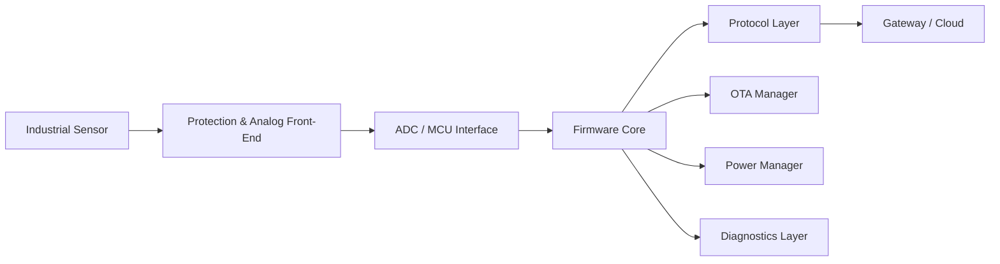

<p align="center">
  
</p>

# Hi there, I'm Nicolás Vásquez Yáñez 👋

### Senior Embedded Systems & Industrial IoT Developer  
#### ESP32 | STM32 | LoRaWAN | Firmware Architecture | Hardware Integration | PCB Design

I build **robust embedded systems, industrial IoT devices, and production-oriented firmware architectures** designed to operate reliably in demanding real-world environments.

With over **8 years of end-to-end hardware and firmware experience**, I specialize in taking products from concept and prototype to field-ready deployment.

> **Embedded firmware is not only about making hardware work.  
> It is about making it keep working in the real world.**

---

## 🚀 Focus Areas

<table>
<tr>
<td width="33%">

### ⚙️ Firmware

- ESP32 / STM32
- C / C++
- FreeRTOS
- OTA updates
- State machines
- Low-level drivers

</td>
<td width="33%">

### 📡 Industrial IoT

- LoRaWAN
- MQTT
- RS485 / Modbus RTU
- UART modem control
- Remote monitoring
- Field diagnostics

</td>
<td width="33%">

### 🔌 Hardware

- PCB-integrated firmware
- Altium Designer
- KiCad
- 4–20 mA / 0–10 V
- Signal conditioning
- Hardware bring-up

</td>
</tr>
</table>

---

## 🧰 Embedded Technology Stack

<p align="center">
  
  
  
  
  
</p>

<p align="center">
  
  
  
  
  
</p>

<p align="center">
  
  
  
  
</p>

<p align="center">
  
  
  
  
  
  
  
  
  
</p>

---

## 🛡️ Firmware Reliability Matrix

| Area | What I Implement |
|---|---|
| **Boot Safety** | OTA partitions, firmware validation, rollback strategy, safe boot workflows |
| **Runtime Stability** | Watchdogs, bounded retries, deterministic state machines, task isolation |
| **Industrial I/O** | 4–20 mA, 0–10 V, RS485, Modbus RTU, relay control, digital I/O |
| **Connectivity** | LoRaWAN, MQTT, WiFi, BLE, UART modem control, XBee/DigiMesh |
| **Power Strategy** | Deep sleep, telemetry cycles, battery operation, solar-powered systems |
| **Field Diagnostics** | Serial logs, error codes, status payloads, remote recovery paths |
| **Hardware Integration** | PCB bring-up, signal validation, peripheral testing, board-level debugging |

---

## 🧩 Embedded System Architecture



---

## 📂 Open-Source Technical Samples

<p align="center">
  <a href="https://github.com/dev-nicolasv/esp32-lorawan-industrial-node">
    
  </a>
  <a href="https://github.com/dev-nicolasv/esp32-robust-ota-architecture">
    
  </a>
</p>

### 📡 ESP32 LoRaWAN Industrial Node

Industrial-grade ESP32 LoRaWAN node template focused on:

- ESP32
- Seeed LoRa-E5 through UART AT commands
- ADS1115 analog acquisition
- 4–20 mA industrial sensor input
- Compact binary payload encoding
- Deep Sleep optimization

**Architecture:** wake → measure → encode → uplink → sleep.

---

### 🔄 ESP32 Robust OTA Architecture

Production-oriented OTA firmware architecture focused on:

- FreeRTOS task isolation
- PID control task separation
- HTTPS firmware download
- SHA-256 firmware validation
- Dual OTA partitions
- Watchdog-aware design
- Automatic rollback protection

**Architecture:** keep critical control logic deterministic while OTA runs safely in parallel.

---

## 🏭 Field Projects

| Project | Area | Focus |
|---|---|---|
| 🌊 [Colbún Hydroelectric Early Warning System](https://www.youtube.com/watch?v=atfTgxQO1dA) | Energy / Monitoring | Environmental monitoring and alert system |
| 🚨 [SAT / EWARS Viña del Mar](https://www.youtube.com/watch?v=G301dtDWlcg) | Urban Risk Prevention | Early warning system development |
| ☁️ [Cloud Seeding System — Mettech Seerain](https://youtu.be/6tkjbmUdPcM) | Atmospheric Systems | Control hardware and embedded integration |
| ⚙️ [Custom Hardware & PCB Development](https://youtu.be/EI487dh6bS8) | Hardware Engineering | Board design, assembly, and firmware integration |
| 🎵 [Musical Swing — Sergafel](https://youtu.be/dYeEN-3rE7M) | Interactive Hardware | Robust public-use hardware |

---

## 📊 GitHub Metrics

<p align="center">
  
</p>

---

## 🧭 Engineering Profile Snapshot

<table>
<tr>
<td width="25%" align="center">

### ⚙️ Firmware

ESP32  
STM32  
C / C++  
FreeRTOS  

</td>
<td width="25%" align="center">

### 📡 IoT

LoRaWAN  
MQTT  
RS485  
Modbus RTU  

</td>
<td width="25%" align="center">

### 🔌 Hardware

Altium  
KiCad  
PCB Design  
Bring-Up  

</td>
<td width="25%" align="center">

### 🛡️ Reliability

OTA  
Rollback  
Watchdogs  
Diagnostics  

</td>
</tr>
</table>

---

## 🧪 Current Areas of Interest

- Industrial LoRaWAN telemetry nodes
- ESP32 OTA update pipelines
- STM32WLE5 / LoRa-E5 modem architectures
- RS485 / Modbus RTU industrial gateways
- Battery and solar-powered IoT systems
- Edge firmware for monitoring and control
- Robust embedded architecture for field deployment
- AI-assisted firmware and PCB workflows
- Industrial monitoring and early warning systems
- Modular IoT hardware for scalable deployments

---

## 👨‍🏫 Mentorship & Community

Beyond industrial development, I am passionate about sharing knowledge.

I conduct online workshops and teach robotics to kids and teenagers, translating complex low-level engineering concepts into accessible learning experiences.

📺 [Watch a snippet of my Online Workshops](https://youtu.be/h6abCMyFRaY)

---

## 🤝 Connect

<p align="center">
  <a href="https://www.linkedin.com/in/nicol%C3%A1s-v%C3%A1squez-y%C3%A1%C3%B1ez-9b8684151/">
    
  </a>
  <a href="https://www.upwork.com/freelancers/~01cc5ecb54a0f95fcc?viewMode=1">
    
  </a>
  <a href="https://github.com/dev-nicolasv">
    
  </a>
</p>

---

## ⚡ Engineering Philosophy

Embedded systems fail in the details:

- bad power design
- noisy signals
- poor recovery logic
- weak OTA strategy
- unclear diagnostics
- fragile prototypes
- untested edge cases

My job is to design firmware and hardware integration that anticipates those problems before the product reaches the field.

**Build it. Validate it. Deploy it. Keep it running.**

<p align="center">
  
</p>
````
