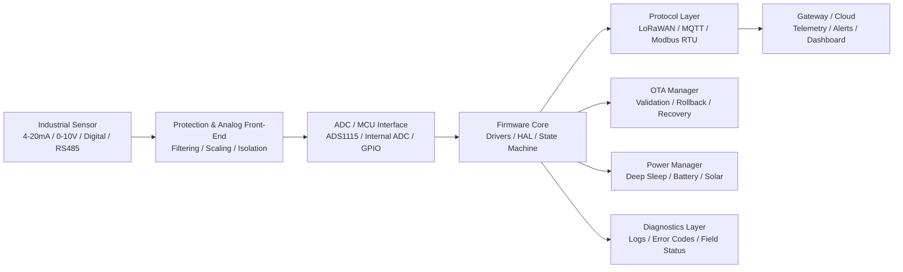

# Hi there, I'm Nicolás Vásquez Yáñez 👋

### Senior Embedded Systems & Industrial IoT Developer  
#### ESP32 | STM32 | LoRaWAN | Firmware Architecture | Hardware Integration | PCB Design

I build **robust embedded systems, industrial IoT devices, and firmware architectures** designed to operate reliably in demanding real-world environments.

With over **8 years of end-to-end hardware and firmware experience**, I specialize in taking projects from concept, prototype, and hardware bring-up to field-ready deployment.

I do not just write code.  
I engineer complete embedded solutions that can survive noise, remote operation, constrained hardware, harsh environments, and strict industrial requirements.

---

## 🚀 What I Build

- Industrial IoT telemetry nodes
- ESP32 and STM32 embedded firmware
- LoRaWAN sensor devices and gateways
- OTA firmware update architectures
- RS485 / Modbus RTU industrial systems
- 4–20 mA and 0–10 V signal acquisition
- Battery and solar-powered embedded devices
- Custom hardware and PCB-integrated firmware
- Field diagnostics and recovery systems
- Prototype rescue and production hardening

> Embedded firmware is not only about making hardware work.  
> It is about making it keep working in the real world.

---

## 🧰 Embedded Technology Stack

### Firmware & Embedded Systems


### Microcontrollers & Platforms


### Development Tools


### Hardware & PCB Design


### IoT, RF & Connectivity


### Industrial Interfaces & Signals


---

## 🛡️ Firmware Reliability Matrix

| Area | What I Implement |
|---|---|
| **Boot Safety** | OTA partitions, firmware validation, rollback strategy, safe boot workflows |
| **Runtime Stability** | Watchdogs, bounded retries, deterministic state machines, task isolation |
| **Industrial I/O** | 4–20 mA, 0–10 V, RS485, Modbus RTU, relay control, digital I/O |
| **Connectivity** | LoRaWAN, MQTT, WiFi, BLE, UART modem control, XBee/DigiMesh |
| **Power Strategy** | Deep sleep, telemetry cycles, battery operation, solar-powered systems |
| **Field Diagnostics** | Serial logs, error codes, status payloads, remote recovery paths |
| **Production Readiness** | Versioning, commissioning flow, validation notes, maintainable architecture |
| **Hardware Integration** | PCB bring-up, signal validation, peripheral testing, board-level debugging |

---

## 🧩 Embedded System Architecture



---

## 🚀 From Prototype to Field Deployment


---

## 📂 Open-Source Technical Samples

These repositories showcase my coding standards, embedded architecture, RTOS management, industrial interfaces, and implementation style.

---

### 📡 ESP32 LoRaWAN Industrial Node

[](https://github.com/dev-nicolasv/esp32-lorawan-industrial-node)

Ultra-low power industrial telemetry boilerplate using:

- ESP32
- Seeed LoRa-E5 through UART AT commands
- ADS1115 analog acquisition
- 4–20 mA industrial sensor input
- Compact binary payload encoding
- Deep Sleep optimization

**Architecture:** wake → measure → encode → uplink → sleep.

---

### 🔄 ESP32 Robust OTA Architecture

[](https://github.com/dev-nicolasv/esp32-robust-ota-architecture)

Production-oriented OTA firmware architecture featuring:

- FreeRTOS task isolation
- PID control task separation
- HTTPS firmware download
- SHA-256 firmware validation
- Dual OTA partitions
- Watchdog-aware design
- Automatic rollback protection

**Architecture:** keep critical control logic deterministic while OTA runs safely in parallel.

---

## 🏭 Featured Industrial & Field Projects

I focus on mission-critical systems where reliability is not optional.

| Project | Area | Focus |
|---|---|---|
| 🌊 [Colbún Hydroelectric Early Warning System](https://www.youtube.com/watch?v=atfTgxQO1dA) | Energy / Monitoring | Robust environmental monitoring and alert system for a major energy facility |
| 🚨 [SAT / EWARS Viña del Mar](https://www.youtube.com/watch?v=G301dtDWlcg) | Urban Risk Prevention | Early warning system development for urban disaster prevention |
| ☁️ [Cloud Seeding System — Mettech Seerain](https://youtu.be/6tkjbmUdPcM) | Atmospheric Systems | Complex control hardware for atmospheric weather modification |
| ⚙️ [Custom Hardware & PCB Development](https://youtu.be/EI487dh6bS8) | Hardware Engineering | Complete board design, assembly, and low-level firmware integration |
| 🎵 [Musical Swing — Sergafel](https://youtu.be/dYeEN-3rE7M) | Interactive Hardware | Robust public-use hardware with embedded control and sensing |

---

## ⚙️ Engineering Capabilities

### Embedded Firmware

- Modular C/C++ firmware architecture
- ESP32 and STM32 development
- RTOS task separation and scheduling
- Deterministic state machines
- Watchdog-aware design
- Driver development and hardware abstraction
- Serial communication and binary protocols
- Peripheral integration and low-level debugging

### Industrial IoT

- LoRaWAN telemetry nodes
- UART AT modem integration
- MQTT communication
- RS485 and Modbus RTU devices
- Sensor telemetry pipelines
- Remote monitoring systems
- Compact payload encoding
- Cloud and gateway integration

### Hardware & PCB

- Schematic and PCB design support
- Industrial-grade board integration
- Analog signal conditioning
- 4–20 mA and 0–10 V acquisition
- Relay, digital I/O, and power-stage integration
- Hardware bring-up and validation
- Board-level troubleshooting

### Reliability & Field Operation

- OTA firmware update flows
- Rollback-safe firmware deployment
- Runtime fault recovery
- Error reporting and diagnostics
- Low-power telemetry cycles
- Battery and solar operation
- Field commissioning support

---

## 📊 GitHub Metrics


---

## 📈 Recent GitHub Activity


---

## 🧪 Current Areas of Interest

- Industrial LoRaWAN telemetry nodes
- ESP32 OTA update pipelines
- STM32WLE5 / LoRa-E5 modem architectures
- RS485 / Modbus RTU industrial gateways
- Battery and solar-powered IoT systems
- Edge firmware for monitoring and control
- Robust embedded architecture for field deployment
- AI-assisted firmware and PCB workflows
- Industrial monitoring and early warning systems
- Modular IoT hardware for scalable deployments

---

## 👨‍🏫 Mentorship & Community

Beyond industrial development, I am passionate about sharing knowledge.

I regularly conduct online workshops and teach robotics to kids and teenagers, translating complex low-level engineering concepts into accessible learning experiences.

📺 [Watch a snippet of my Online Workshops](https://youtu.be/h6abCMyFRaY)

---

## 🧰 Repository Quality Principles

When I publish technical repositories, I aim to include:

- Clear architecture overview
- Hardware wiring notes
- PlatformIO build instructions
- Industrial use-case explanation
- Payload format documentation
- Commissioning notes
- Security and operational considerations
- Future production-hardening roadmap

---

## 🤝 Let's Work Together

Looking for a senior embedded systems developer to architect your next IoT product, industrial telemetry node, control system, or to rescue a failing prototype?

Let's discuss your technical requirements.

[](https://www.linkedin.com/in/nicol%C3%A1s-v%C3%A1squez-y%C3%A1%C3%B1ez-9b8684151/)
[](https://www.upwork.com/freelancers/~01cc5ecb54a0f95fcc?viewMode=1)
[](https://github.com/dev-nicolasv)

---

## ⚡ Engineering Philosophy

Embedded systems fail in the details:

- Bad power design
- Noisy signals
- Poor recovery logic
- Weak OTA strategy
- Unclear diagnostics
- Fragile prototypes
- Untested edge cases

My job is to design firmware and hardware integration that anticipates those problems before the product reaches the field.

**Build it. Validate it. Deploy it. Keep it running.**
````
